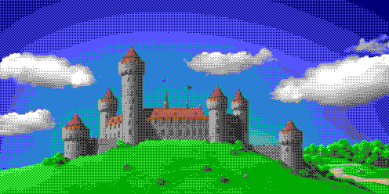
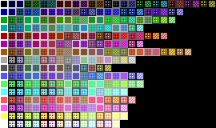
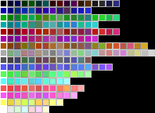
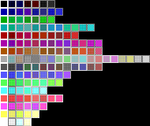

# ComfyUI-Retro-Pixel-Matrix-Dither

An advanced custom node for ComfyUI designed to convert images into authentic, low-color retro graphics and pixel art. Unlike standard dithering algorithms, this tool uses a specialized multi-ratio matrix mixing technique combined with human-eye perception logic.

Developed via human-AI collaboration: Algorithm conceptualized by me, code implementation by Gemini.

### 🚀 Key Features

* **Intelligent Cone-Model Clashing Protection:** Automatically calculates perceptual color distances using an absolute H-S-Luminance cone weight system. It prevents ugly, high-contrast dithering patterns (like mixing blue and yellow) while allowing smooth shading between similar tones.
* **Contour & Edge Protection:** Built-in edge detection ensures sharp object outlines remain clean and solid, avoiding messy dithering noise on distinct borders.
* **Classic Hardware Presets:** Built-in palettes optimized for iconic retro systems: **Amiga**, **Atari ST**, **EGA**, **Commodore 64**, **GameBoy (DMG-01)**, and **CGA**.
* **Fully Custom Palettes:** Paste your own HEX codes or RGB values directly into the node.
* **Interactive Tuning:** Calibrate your weights visually using the included web-based Matrix Tuner tool.

### Gallery

| Original Image | Dithered Result (customized EGA Palette) |
| :---: | :---: |
|  |  |

---

## 🎛️ Diagnostic Pattern Matrix & Calibration

The script allows you to export a diagnostic matrix image (`-w` / `--show-patterns`) to visually evaluate which 2x2 Bayer dither textures are permitted by your current settings. 

### Understanding the Matrix Cell Backgrounds
Each cell in the grid displays a 2x2 multi-ratio dither blend between two colors. The **background frame** behind the pattern represents its **Reliability** calculated by the perceptual algorithm:
* **Bright/White Background:** High reliability. The color combination is perceptually harmonious, smooth, and safe to use.
* **Dark/Black Background:** High penalty. The colors clash too aggressively in brightness or hue; the algorithm suppresses this pattern to avoid noisy artifacts.

### Calibration Examples

| No Distance Limit (`-m 255 -cw 20 -bw 260`) | Balanced / Strict (`-m 150 -cw 50 -bw 100`) | New Experimental Sweetspot (`-m 105 -cw 20 -bw 260`) |
| :---: | :---: | :---: |
|  |  |  |
| *Every mix is allowed. High noise.* | `python retro_matrix_dither.py -w -m 150 -cw 50 -bw 100` | *Default. Clean, authentic hardware look.* |

---

## 🌐 Web-Based Color & Matrix Tuner

Want to find your own perfect dither preset? We've included an interactive HTML tool called `color-tuner.html` 😉. It lets you tweak the distance limits and weights in real-time with visual sliders and instantly copies the values for your ComfyUI nodes.

### How to run the Tuner:
You don't need to install anything. You can launch it instantly directly from this repository:
* 🌐 **[Launch Retro Dither Matrix Tuner Pro Pro Live](https://htmlpreview.github.io/?https://github.com/vitacon/ComfyUI-Retro-Pixel-Matrix-Dither/blob/main/color-tuner.html)**
* Alternatively, just download the `color-tuner.html` file from this repo and open it locally in any web browser.

---

## History

### July 11, 2026 (v1.2.0)
* **Mathematical Calibration & Tuner Sync:** Synchronized the Python rendering backend with the web-based HTML tuner. The diagnostic `-w` pattern mappers now accurately reflect the 0–100% "Reliability" shading, making Python matrix exports perfectly consistent with the web interface.
* **Expanded Retro Roster:** Added iconic 4-color ancient hardware presets: **GameBoy (DMG-01)** green-phosphor aesthetic and the high-contrast **CGA (Palette 1)**.
* **New Optimized Defaults:** Shifted to an experimentally proven sweet spot (`max_mix_rgb_distance=105`, `color_weight=20`, `brightness_weight=260`) as the absolute out-of-the-box standard for superior pixel-art gradients.

### July 11, 2026 (v1.1.0)
* **Lazy Pattern Generation:** Added a `patterns_preview` widget switch (`enable`/`disable`). Bypasses heavy diagnostic calculations when disabled for instant ComfyUI workflow execution.
* **Architecture Refactoring:** Isolated the pattern-rendering logic into `core_generate_patterns` for identical behavior between ComfyUI and standalone CLI.

### July 10, 2026 (v1.0.0)
* **Initial release**
